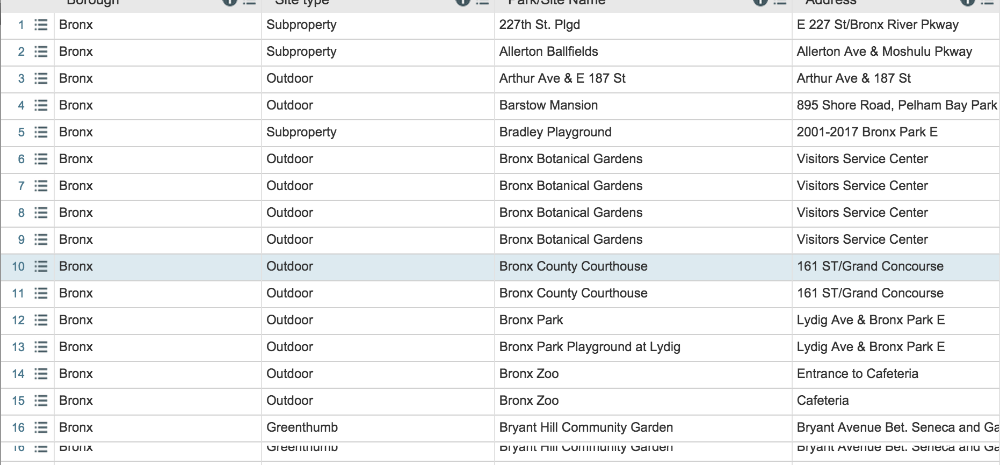

## Recyc.ly

---

###Introduction

Welcome to our **recycling** terminal application! In an attempt to promote a *cleaner and healthier environment* for *New York City*, we sought to create an application that allows the user to take control of this mantra.

---

###How We Did It

We used *NYC OpenData* in order to obtain records about public recycling bins citywide.This chart happens to organize the information.

This chart has several columns that refer to searchable paramaters such as *boroughs,site type, and the site itself*. Ideally, we want users to be able to narrow down their search via these parameters until it returns the number of trashcans for your particular need. For example, if the user were outdoors in the Bronx borough and near the Bronx Botantical Gardens, he or she should be able to get the number of cans with an address return.

---

###Technologies Used

We chose to approach this noble task via a **MVC** (Model, View, Controller) model with a *open_uri* gem and a *JSON* gem in row. The latter were important for working with bringing the URL and extracting the information.

Starting with the model, we defined a class called *Recycling_Bin* that carries the parameters that are relatively the same as the table itself. In addition to the model, we also added a parser module that reads through the information and will help query.

The controller and viewer are both responsible for the user experience. Instead of presenting results, the application asks questions that require a string response. The program stores the string response and then sends it to the query methods created in our model. After this, it returns a sets of result with a count of recycling bins.

---

###Learning Experience

This application was an exercise to practice interacting with real-world data sets. We envision people using this application as a guide to leading a lifestyle that benefits the environment instead of damaging it. Although not everyone will want to use this application, the mere existence of this application on the internet may lead to users possibly trying it. Excelsior!

